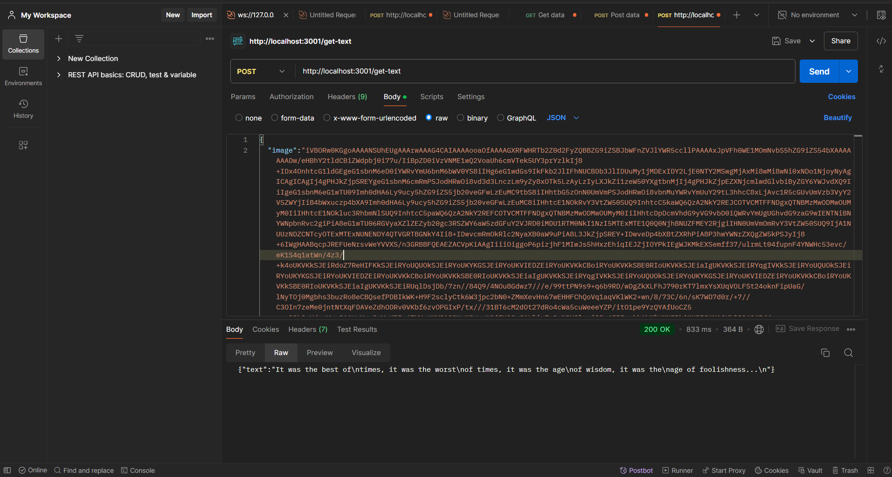


# **Tesseract OCR Server**

This project provides a Node.js server that runs Tesseract OCR Version 5 and exposes two APIs:
- **`/get-text`**: Extract the text from an image.
- **`/get-boxes`**: Extract bounding boxes for specific text types (`word`, `line`, `paragraph`, `block`, or `symbol`).

## **Table of Contents**
1. [Features](#features)
2. [Setup Instructions](#setup-instructions)
3. [API Endpoints](#api-endpoints)
4. [Docker Instructions](#docker-instructions)
5. [Running the Server Locally](#running-the-server-locally)
6. [Pulling Docker Image to DockerHub](#pulling-docker-image-from-dockerhub)

---

## **Features**

- **Extract Text**: OCR functionality to extract the entire text from an image.
- **Extract Bounding Boxes**: Get bounding boxes for specific elements in the image like words or paragraphs.
- **Error Handling**: Handles invalid base64 images and invalid bounding box types.

---

## **Setup Instructions**

To set up the project locally:

### **1. Clone the Repository**
```bash
git clone https://github.com/rohhann12/tesseract-ocr-server.git
cd tesseract-ocr-server
```

### **2. Install Dependencies**

Ensure you have Node.js and npm installed. Then, install the required dependencies:

```bash
npm install
```

### **3. Run the Server Locally**


```bash
node index.js
```

The server will start at `http://localhost:3000`.

---

## **API Endpoints**

### **1. `/get-text`**
- **Method**: POST
- **Description**: Extract the entire text from an image.
- **Request Body**:
  - `image`: Base64-encoded image as in the request as {"image":}
- **Response**:
  ```json
  {
    "text": "Extracted text from image"
  }
  ```

### **2. `/get-boxes`**
- **Method**: POST
- **Description**: Extract bounding boxes of a particular type from an image.
- **Request Body**:
  - `image`: Base64-encoded image as in the request as {"image":}
  - `type`: The type of bounding box (`word`, `line`, `paragraph`, `block`, `symbol`,`ALL`).
- **Response**:
  ```json
  {
    "boxes": [
      {
        "text": "Sample",
        "bbox": { "x": 100, "y": 200, "width": 50, "height": 20 }
      }
    ]
  }
  ```

---

**EITHER RUN THE SERVER LOCALLY OR PULL THE IMAGE AND THEN RUN IT**

### **1. Pulling docker Image**

```bash
docker pull rsharma7be22616/tesseract-ocr-server-docker-image:latest
```
### **2. running docker Image**

```bash
docker run -p 3000:3000 rsharma7be22616/tesseract-ocr-server-docker-image:latest
```

---

## **Conclusion**

This project demonstrates a simple Node.js server using Tesseract OCR to extract text and bounding boxes from images. The server can be run locally or in a Docker container, and the image can be pushed to DockerHub for easy deployment.
## **Postman Testing**

### **1. Testing `/get-text` API**

This is an example of testing the `/get-text` API using Postman:



### **2. Testing `/get-boxes` API**

This is an example of testing the `/get-boxes` API using Postman:


